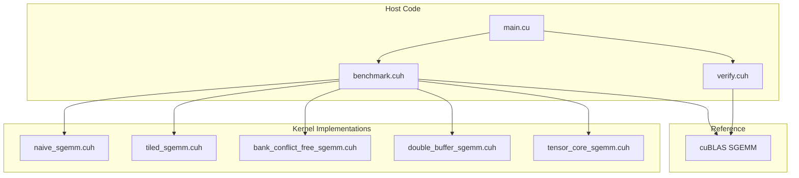

# Design Document: SGEMM Optimization

## Overview

本设计文档描述了一个渐进式 CUDA SGEMM 优化系统的架构和实现细节。系统从最基础的 Naive 实现开始，逐步引入共享内存分块、Bank Conflict 消除、双缓冲流水线、以及 Tensor Core 加速，最终达到接近 cuBLAS 的性能水平。

整体架构采用模块化设计，每个优化版本作为独立的 Kernel 实现，共享统一的基准测试和验证框架。

## Architecture



### 目录结构

```
sgemm-optimization/
├── src/
│   ├── kernels/
│   │   ├── naive_sgemm.cuh
│   │   ├── tiled_sgemm.cuh
│   │   ├── bank_conflict_free_sgemm.cuh
│   │   ├── double_buffer_sgemm.cuh
│   │   └── tensor_core_sgemm.cuh
│   ├── utils/
│   │   ├── benchmark.cuh
│   │   ├── verify.cuh
│   │   └── cuda_utils.cuh
│   └── main.cu
├── tests/
│   └── test_sgemm.cu
├── Makefile
└── README.md
```

## Components and Interfaces

### 1. Kernel 接口规范

所有 Kernel 遵循统一的函数签名：

```cpp
// 统一的 Kernel 启动接口
template<int BLOCK_SIZE>
void launch_sgemm_kernel(
    const float* A,      // M x K 矩阵
    const float* B,      // K x N 矩阵
    float* C,            // M x N 输出矩阵
    int M, int K, int N, // 矩阵维度
    cudaStream_t stream = 0
);
```

### 2. Naive Kernel 设计

```cpp
// 每个线程计算一个输出元素
__global__ void naive_sgemm_kernel(
    const float* __restrict__ A,
    const float* __restrict__ B,
    float* __restrict__ C,
    int M, int K, int N
) {
    int row = blockIdx.y * blockDim.y + threadIdx.y;
    int col = blockIdx.x * blockDim.x + threadIdx.x;
    
    if (row < M && col < N) {
        float sum = 0.0f;
        for (int k = 0; k < K; ++k) {
            sum += A[row * K + k] * B[k * N + col];
        }
        C[row * N + col] = sum;
    }
}
```

**性能瓶颈分析**：
- 每次内循环都从 Global Memory 读取 A 和 B
- A 的访问是行优先，B 的访问是列优先（非合并访问）
- 计算访存比极低，严重受限于内存带宽

### 3. Tiled Kernel 设计

```cpp
template<int TILE_SIZE>
__global__ void tiled_sgemm_kernel(
    const float* __restrict__ A,
    const float* __restrict__ B,
    float* __restrict__ C,
    int M, int K, int N
) {
    __shared__ float As[TILE_SIZE][TILE_SIZE];
    __shared__ float Bs[TILE_SIZE][TILE_SIZE];
    
    int bx = blockIdx.x, by = blockIdx.y;
    int tx = threadIdx.x, ty = threadIdx.y;
    
    int row = by * TILE_SIZE + ty;
    int col = bx * TILE_SIZE + tx;
    
    float sum = 0.0f;
    
    // 遍历所有 tile
    for (int t = 0; t < (K + TILE_SIZE - 1) / TILE_SIZE; ++t) {
        // 协作加载 tile 到共享内存
        if (row < M && t * TILE_SIZE + tx < K)
            As[ty][tx] = A[row * K + t * TILE_SIZE + tx];
        else
            As[ty][tx] = 0.0f;
            
        if (t * TILE_SIZE + ty < K && col < N)
            Bs[ty][tx] = B[(t * TILE_SIZE + ty) * N + col];
        else
            Bs[ty][tx] = 0.0f;
        
        __syncthreads();
        
        // 计算部分和
        for (int k = 0; k < TILE_SIZE; ++k) {
            sum += As[ty][k] * Bs[k][tx];
        }
        
        __syncthreads();
    }
    
    if (row < M && col < N) {
        C[row * N + col] = sum;
    }
}
```

**优化原理**：
- 将 Global Memory 访问转换为 Shared Memory 访问
- 每个 tile 只从 Global Memory 加载一次，复用 TILE_SIZE 次
- 数据复用率提升 TILE_SIZE 倍

### 4. Bank Conflict Free Kernel 设计

```cpp
template<int TILE_SIZE>
__global__ void bank_conflict_free_sgemm_kernel(
    const float* __restrict__ A,
    const float* __restrict__ B,
    float* __restrict__ C,
    int M, int K, int N
) {
    // 添加 padding 消除 bank conflict
    __shared__ float As[TILE_SIZE][TILE_SIZE + 1];  // +1 padding
    __shared__ float Bs[TILE_SIZE][TILE_SIZE + 1];  // +1 padding
    
    // ... 其余逻辑与 tiled 版本相同
}
```

**Bank Conflict 分析**：
- 共享内存分为 32 个 bank，每个 bank 4 字节宽
- 当 warp 中多个线程访问同一 bank 的不同地址时产生冲突
- 添加 1 列 padding 使得列访问跨越不同 bank

### 5. Double Buffer Kernel 设计

```cpp
template<int TILE_SIZE>
__global__ void double_buffer_sgemm_kernel(
    const float* __restrict__ A,
    const float* __restrict__ B,
    float* __restrict__ C,
    int M, int K, int N
) {
    // 双缓冲区
    __shared__ float As[2][TILE_SIZE][TILE_SIZE + 1];
    __shared__ float Bs[2][TILE_SIZE][TILE_SIZE + 1];
    
    int bx = blockIdx.x, by = blockIdx.y;
    int tx = threadIdx.x, ty = threadIdx.y;
    int row = by * TILE_SIZE + ty;
    int col = bx * TILE_SIZE + tx;
    
    float sum = 0.0f;
    int numTiles = (K + TILE_SIZE - 1) / TILE_SIZE;
    
    // 预加载第一个 tile
    int writeIdx = 0;
    load_tile(A, B, As[writeIdx], Bs[writeIdx], 0, row, col, M, K, N);
    __syncthreads();
    
    for (int t = 0; t < numTiles; ++t) {
        int readIdx = writeIdx;
        writeIdx = 1 - writeIdx;
        
        // 预取下一个 tile（与计算重叠）
        if (t + 1 < numTiles) {
            load_tile(A, B, As[writeIdx], Bs[writeIdx], t + 1, row, col, M, K, N);
        }
        
        // 计算当前 tile
        for (int k = 0; k < TILE_SIZE; ++k) {
            sum += As[readIdx][ty][k] * Bs[readIdx][k][tx];
        }
        
        __syncthreads();
    }
    
    if (row < M && col < N) {
        C[row * N + col] = sum;
    }
}
```

**流水线原理**：
- 使用两个缓冲区交替进行加载和计算
- 当计算 tile[t] 时，同时预取 tile[t+1]
- 掩盖 Global Memory 访问延迟

### 6. Tensor Core Kernel 设计

```cpp
#include <mma.h>
using namespace nvcuda;

template<int WMMA_M = 16, int WMMA_N = 16, int WMMA_K = 16>
__global__ void tensor_core_sgemm_kernel(
    const half* __restrict__ A,
    const half* __restrict__ B,
    float* __restrict__ C,
    int M, int K, int N
) {
    // WMMA fragments
    wmma::fragment<wmma::matrix_a, WMMA_M, WMMA_N, WMMA_K, half, wmma::row_major> a_frag;
    wmma::fragment<wmma::matrix_b, WMMA_M, WMMA_N, WMMA_K, half, wmma::row_major> b_frag;
    wmma::fragment<wmma::accumulator, WMMA_M, WMMA_N, WMMA_K, float> c_frag;
    
    // 初始化累加器
    wmma::fill_fragment(c_frag, 0.0f);
    
    int warpM = (blockIdx.y * blockDim.y + threadIdx.y) / 32 * WMMA_M;
    int warpN = (blockIdx.x * blockDim.x + threadIdx.x) / 32 * WMMA_N;
    
    // 遍历 K 维度
    for (int k = 0; k < K; k += WMMA_K) {
        // 加载 A 和 B fragments
        wmma::load_matrix_sync(a_frag, A + warpM * K + k, K);
        wmma::load_matrix_sync(b_frag, B + k * N + warpN, N);
        
        // 执行矩阵乘累加
        wmma::mma_sync(c_frag, a_frag, b_frag, c_frag);
    }
    
    // 存储结果
    wmma::store_matrix_sync(C + warpM * N + warpN, c_frag, N, wmma::mem_row_major);
}
```

**Tensor Core 特性**：
- 每个 Tensor Core 操作执行 4x4x4 矩阵乘累加
- WMMA API 以 16x16x16 为单位操作
- 支持 FP16 输入，FP32 累加
- 理论峰值性能远超 CUDA Core

### 7. Benchmark 系统设计

```cpp
struct BenchmarkResult {
    std::string kernel_name;
    int M, K, N;
    float time_ms;
    float gflops;
    float bandwidth_gb_s;
    bool correct;
    float max_error;
};

class SGEMMBenchmark {
public:
    // 运行单个 kernel 的基准测试
    template<typename KernelFunc>
    BenchmarkResult run(
        const std::string& name,
        KernelFunc kernel,
        int M, int K, int N,
        int warmup_runs = 5,
        int benchmark_runs = 20
    );
    
    // 运行所有 kernel 并生成报告
    void run_all(int M, int K, int N);
    
    // 输出 Roofline 分析数据
    void export_roofline_data(const std::string& filename);
    
private:
    std::vector<BenchmarkResult> results_;
    
    float compute_gflops(int M, int K, int N, float time_ms) {
        // GEMM: 2*M*N*K FLOPs
        return (2.0f * M * N * K) / (time_ms * 1e6);
    }
};
```

### 8. 验证系统设计

```cpp
class SGEMMVerifier {
public:
    // 使用 cuBLAS 作为参考
    void compute_reference(
        const float* A, const float* B, float* C_ref,
        int M, int K, int N
    );
    
    // 验证结果正确性
    VerifyResult verify(
        const float* C_test, const float* C_ref,
        int M, int N,
        float rtol = 1e-4,  // 相对误差阈值
        float atol = 1e-5   // 绝对误差阈值
    );
    
private:
    cublasHandle_t handle_;
};

struct VerifyResult {
    bool passed;
    float max_abs_error;
    float max_rel_error;
    int error_count;
};
```

## Data Models

### 矩阵存储格式

所有矩阵采用行优先 (Row-Major) 存储：

```cpp
// 矩阵 A[M][K] 存储为一维数组
// A[i][j] = A_data[i * K + j]

struct Matrix {
    float* data;      // 设备指针
    int rows;         // M
    int cols;         // K or N
    size_t pitch;     // 对齐后的行字节数（可选）
};
```

### 性能数据模型

```cpp
struct PerformanceMetrics {
    // 时间指标
    float kernel_time_ms;
    float total_time_ms;  // 包含数据传输
    
    // 计算指标
    float gflops;
    float theoretical_gflops;
    float compute_efficiency;  // gflops / theoretical_gflops
    
    // 内存指标
    float bandwidth_gb_s;
    float theoretical_bandwidth;
    float memory_efficiency;
    
    // Roofline 分析
    float arithmetic_intensity;  // FLOPs / Bytes
    bool compute_bound;          // true if compute-bound
};
```

## Correctness Properties

*A property is a characteristic or behavior that should hold true across all valid executions of a system-essentially, a formal statement about what the system should do. Properties serve as the bridge between human-readable specifications and machine-verifiable correctness guarantees.*


### Property 1: Kernel Numerical Correctness

*For any* valid input matrices A (M×K) and B (K×N) where dimensions are multiples of 32, and *for any* SGEMM kernel implementation (Naive, Tiled, BankConflictFree, DoubleBuffer), the computed output C should match the cuBLAS reference result within relative error tolerance of 1e-4.

**Validates: Requirements 1.1, 1.3, 2.4, 3.3, 4.4**

### Property 2: Tensor Core Kernel Correctness

*For any* valid input matrices A (M×K) and B (K×N) where dimensions are multiples of 16, the TensorCore_Kernel output should match the cuBLAS reference result within relative error tolerance of 1e-3 (relaxed due to FP16 intermediate precision).

**Validates: Requirements 5.3**

### Property 3: Error Detection Correctness

*For any* kernel output and reference output pair, *if* the maximum relative error exceeds the threshold (1e-4 for standard kernels, 1e-3 for Tensor Core), *then* the Verification_System should flag the result as incorrect.

**Validates: Requirements 7.3, 7.4**

### Property 4: Dimension Invariance

*For any* two valid matrix dimension sets (M1, K1, N1) and (M2, K2, N2) that are multiples of 32, *if* both produce correct results individually, *then* the kernel implementation is dimension-agnostic (no hardcoded assumptions about specific sizes).

**Validates: Requirements 1.5, 2.6**

## Error Handling

### CUDA Error Handling

```cpp
#define CUDA_CHECK(call) \
    do { \
        cudaError_t err = call; \
        if (err != cudaSuccess) { \
            fprintf(stderr, "CUDA error at %s:%d: %s\n", \
                    __FILE__, __LINE__, cudaGetErrorString(err)); \
            exit(EXIT_FAILURE); \
        } \
    } while(0)

#define CUBLAS_CHECK(call) \
    do { \
        cublasStatus_t status = call; \
        if (status != CUBLAS_STATUS_SUCCESS) { \
            fprintf(stderr, "cuBLAS error at %s:%d: %d\n", \
                    __FILE__, __LINE__, status); \
            exit(EXIT_FAILURE); \
        } \
    } while(0)
```

### 边界条件处理

1. **矩阵维度验证**：检查维度是否为正数且满足对齐要求
2. **内存分配失败**：检查 cudaMalloc 返回值
3. **Kernel 启动失败**：使用 cudaGetLastError() 检查
4. **数值溢出**：使用 isnan/isinf 检查结果

### 错误恢复策略

```cpp
class SGEMMContext {
public:
    SGEMMContext(int M, int K, int N);
    ~SGEMMContext();  // RAII 自动释放资源
    
    bool is_valid() const { return valid_; }
    const char* error_message() const { return error_msg_.c_str(); }
    
private:
    float *d_A_, *d_B_, *d_C_;
    bool valid_;
    std::string error_msg_;
};
```

## Testing Strategy

### 测试框架选择

- **单元测试**: Google Test (gtest)
- **属性测试**: 自定义随机矩阵生成器 + 参数化测试

### 单元测试

单元测试验证特定示例和边界情况：

```cpp
// 测试小矩阵的正确性
TEST(NaiveSGEMM, SmallMatrix) {
    // 32x32 矩阵，已知结果
}

// 测试边界情况
TEST(TiledSGEMM, NonSquareMatrix) {
    // M != N != K 的情况
}

// 测试零矩阵
TEST(AllKernels, ZeroMatrix) {
    // 输入包含零的情况
}
```

### 属性测试

属性测试使用随机生成的矩阵验证通用属性：

```cpp
// 属性测试配置
constexpr int PBT_ITERATIONS = 100;

// 随机矩阵生成器
class MatrixGenerator {
public:
    void generate(float* data, int rows, int cols, 
                  float min_val = -1.0f, float max_val = 1.0f);
    
    // 生成特定模式的矩阵
    void generate_identity(float* data, int n);
    void generate_diagonal(float* data, int n, float val);
};

// 属性测试示例
// Feature: sgemm-optimization, Property 1: Kernel Numerical Correctness
TEST_P(SGEMMPropertyTest, KernelCorrectnessProperty) {
    auto [M, K, N] = GetParam();
    
    // 生成随机矩阵
    generator_.generate(h_A_, M, K);
    generator_.generate(h_B_, K, N);
    
    // 计算参考结果
    cublas_sgemm(h_A_, h_B_, h_C_ref_, M, K, N);
    
    // 测试所有 kernel
    for (auto& kernel : kernels_) {
        kernel(h_A_, h_B_, h_C_test_, M, K, N);
        EXPECT_TRUE(verify(h_C_test_, h_C_ref_, M, N, 1e-4f));
    }
}

INSTANTIATE_TEST_SUITE_P(
    RandomDimensions,
    SGEMMPropertyTest,
    ::testing::ValuesIn(generate_random_dimensions(PBT_ITERATIONS))
);
```

### 测试矩阵维度

```cpp
// 标准测试维度
std::vector<std::tuple<int,int,int>> test_dimensions = {
    {32, 32, 32},      // 最小
    {128, 128, 128},   // 小
    {512, 512, 512},   // 中
    {1024, 1024, 1024},// 大
    {2048, 2048, 2048},// 很大
    {4096, 4096, 4096},// 最大
    // 非方阵
    {512, 1024, 768},
    {1024, 512, 2048},
};
```

### 性能回归测试

```cpp
// 确保优化版本不会比前一版本慢
TEST(PerformanceRegression, TiledFasterThanNaive) {
    auto naive_gflops = benchmark(naive_kernel, M, K, N);
    auto tiled_gflops = benchmark(tiled_kernel, M, K, N);
    EXPECT_GT(tiled_gflops, naive_gflops * 1.5);  // 至少快 50%
}
```

### 测试覆盖要求

| 测试类型 | 覆盖范围 | 迭代次数 |
|---------|---------|---------|
| 单元测试 | 边界情况、特殊值 | 固定用例 |
| 属性测试 | 随机维度、随机数据 | 100+ |
| 性能测试 | 标准维度 | 20 次取平均 |
