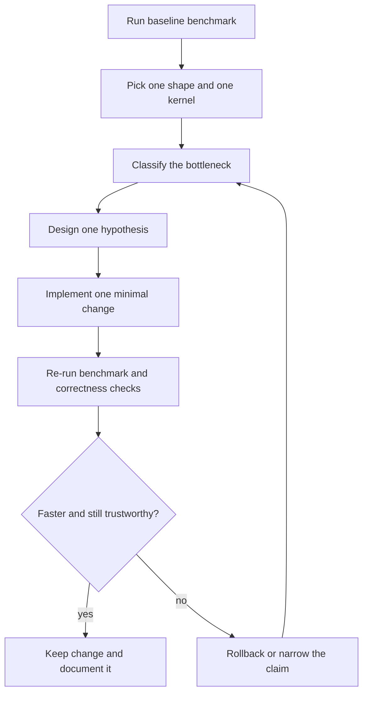

# Diagnosis Loop

A practical SGEMM tuning loop must separate observation, hypothesis, and validation.

## End-to-end optimization loop

Use one loop per hypothesis. The loop is deliberately small because the goal is learning, not motion.

## Bottleneck classification heuristics

| Signal | Likely bottleneck | First place to look |
|-------|-------------------|---------------------|
| Naive to tiled jumps hard, later gains flatten | Memory movement is still dominant | Shared-memory reuse and global access patterns |
| Tiled improves, bank-free improves again | Shared-memory conflicts are real | Shared-memory layout and bank mapping |
| Double buffering underperforms expectations | Overlap is incomplete or occupancy fell | Register pressure, stage count, launch geometry |
| WMMA compute-only looks good, end-to-end does not | Conversion, staging, or fallback overhead dominates | FP32→FP16 staging and fast-path guards |
| Irregular shapes regress sharply | Alignment assumptions are too strong | Fallback path and shape-sensitive guards |

## Architecture-aware case patterns

### Case A: Tensor Core slower than expected on Volta/Turing

**Signal**  
`WMMA end-to-end` is close to, or below, FP32 kernels.

**Likely causes**
- Dimensions are often not 16-aligned, so fallback behavior dominates.
- Conversion and wrapper overhead erase compute gains.

**Actions**
1. Compare one aligned shape and one irregular shape side by side.
2. Read `WMMA compute-only` next to `WMMA end-to-end`, never in isolation.
3. Keep the fallback path stable while tuning staging boundaries.

### Case B: Ampere/Ada gains stall after tiled SGEMM

**Signal**  
`Tiled` improves clearly, but `Double Buffer` and `Tensor Core` gains stay weak.

**Likely causes**
- Additional stages are not overlapping enough work.
- Register pressure lowers active warps.

**Actions**
1. Try a smaller block or tile shape first.
2. Check whether more stages raise total time instead of reducing it.
3. Re-run correctness after every launch-geometry change.

### Case C: Hopper compute-only scales but end-to-end remains flat

**Signal**  
`WMMA compute-only` grows, while the full pipeline barely moves.

**Likely causes**
- Data movement or conversion flow dominates total time.
- The benchmark window is too short to stabilize the pipeline.

**Actions**
1. Increase warmup and benchmark iterations.
2. Profile conversion and launch overhead as separate segments.
3. Improve overlap strategy before touching micro-level compute code.

## Stop conditions

Stop the loop and hand the claim to [Validation](/en/validation/) when:

- the speedup survives `ctest --test-dir build`
- the result is labeled with the correct benchmark scope
- the shape coverage matches the claim you want to make
- the command and environment are recorded well enough to reproduce

If any of those fail, the right move is usually rollback, not explanation.
