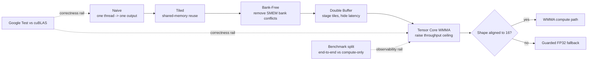

<div class="home-shell">
  <div class="home-hero-grid">
    <div>
      <p class="home-eyebrow">CUDA SGEMM ENGINEERING NOTEBOOK</p>
      <h1 class="home-main-title">SGEMM Optimization</h1>
      <p class="home-main-subtitle">
        A bilingual, benchmark-backed route from baseline FP32 kernels to guarded Tensor Core WMMA.
        Keep the code readable, keep every speedup explainable.
      </p>
      <div class="home-action-row">
        <a class="btn" href="/en/getting-started">Start in 5 minutes</a>
        <a class="btn btn-outline" href="/en/learning-path">Follow the kernel ladder</a>
        <a class="btn btn-outline" href="https://github.com/LessUp/sgemm-optimization">GitHub</a>
      </div>
    </div>
    <div class="signal-grid">
      <div class="signal-card">
        <div class="signal-title">Optimization stages</div>
        <div class="signal-value">5</div>
        <div class="signal-note">naive -> WMMA</div>
      </div>
      <div class="signal-card">
        <div class="signal-title">Correctness oracle</div>
        <div class="signal-value">cuBLAS</div>
        <div class="signal-note">separate tolerances for FP32 / Tensor Core</div>
      </div>
      <div class="signal-card">
        <div class="signal-title">Validation boundary</div>
        <div class="signal-value">CI + GPU</div>
        <div class="signal-note">compile in CI, runtime on local CUDA machine</div>
      </div>
      <div class="signal-card">
        <div class="signal-title">Language support</div>
        <div class="signal-value">EN / 中文</div>
        <div class="signal-note">auto-switchable site with paired pages</div>
      </div>
    </div>
  </div>
</div>

## One diagram for the whole project



## Core essence

| Essence | Why it matters | Where to see it |
|---------|----------------|-----------------|
| Progressive kernel ladder | Every optimization step has one clear purpose and measurable impact | [Learning Path](/en/learning-path) |
| Unified launcher contract | Kernels stay swappable for benchmark and verification | [Architecture](/en/architecture) |
| Verification-first workflow | Performance claims are always attached to correctness checks | [Benchmark Results](/en/benchmark-results) |
| OpenSpec governance | Docs, implementation, and repository process stay aligned | [Specifications](https://github.com/LessUp/sgemm-optimization/tree/master/openspec) |

## Knowledge hub

<div class="knowledge-grid">
  <a class="knowledge-card" href="/en/optimization-playbook">
    <h3>Optimization Playbook</h3>
    <p>A practical diagnosis loop for SGEMM bottlenecks, decision trees, and experiment templates.</p>
  </a>
  <a class="knowledge-card" href="/en/performance-casebook">
    <h3>Performance Casebook</h3>
    <p>Architecture-specific tuning priorities for Volta, Turing, Ampere, Ada, and Hopper GPUs.</p>
  </a>
  <a class="knowledge-card" href="/en/cuda-memory-cheatsheet">
    <h3>CUDA Memory Cheat Sheet</h3>
    <p>Coalescing, shared-memory banks, occupancy hints, and profiler metric mapping in one place.</p>
  </a>
  <a class="knowledge-card" href="/en/kernel-tensor-core">
    <h3>Tensor Core in practice</h3>
    <p>Understand why WMMA needs alignment constraints, and how guarded fallback keeps behavior safe.</p>
  </a>
</div>

## Command cockpit

```bash
# Build
cmake -S . -B build -DCMAKE_BUILD_TYPE=Release
cmake --build build -j$(nproc)

# Validate
ctest --test-dir build
openspec validate --all

# Benchmark
./build/bin/sgemm_benchmark -a
./build/bin/sgemm_benchmark --dims 256 384 640
```

## Choose your route

| If you want to... | Start here |
|-------------------|------------|
| Build and run once | [Getting Started](/en/getting-started) |
| Learn in intended order | [Learning Path](/en/learning-path) |
| Build optimization intuition | [Optimization Playbook](/en/optimization-playbook) |
| Tune for your GPU architecture | [Performance Casebook](/en/performance-casebook) |
| Refresh CUDA memory details | [CUDA Memory Cheat Sheet](/en/cuda-memory-cheatsheet) |
| Switch to Chinese site | [中文首页](/zh/) |
