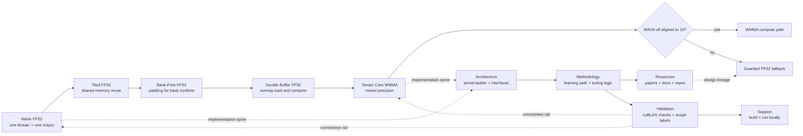

  

    

      
CUDA SGEMM WHITEPAPER LANDING PAGE

      <h1 class="home-main-title">SGEMM as a technical argument</h1>
      

        This site explains the SGEMM project as a coherent engineering argument: begin with a simple CUDA matrix
        multiplication baseline, climb through staged architectural changes, and only accept performance claims when
        correctness checks, benchmark scope labels, and validation boundaries still hold. Architecture, methodology,
        resources, validation, and support are organized as one knowledge model so a new technical reader can see both
        the implementation ladder and the evidence model from the homepage alone.
      

      

        <a class="btn" href="/en/architecture/">Read the architecture map</a>
        <a class="btn btn-outline" href="/en/learning-path">Follow the methodology</a>
        <a class="btn btn-outline" href="/en/benchmark-results">Check the validation boundary</a>
        <a class="btn btn-outline" href="https://github.com/LessUp/sgemm-optimization">GitHub</a>
      

      

        5-stage kernel ladder
        cuBLAS-anchored evidence
        EN / ZH mirrored
      

    

    

      

        
Core Question

        
Why is each kernel faster?

        
Every stage should earn its complexity by changing memory behavior or execution shape.

      

      

        
Evidence Model

        
cuBLAS + scope labels

        
Correctness comparisons and benchmark labeling keep claims interpretable instead of promotional.

      

      

        
Validation Boundary

        
CI is not a GPU

        
Hosted automation proves build and structure health; local hardware proves runtime and performance.

      

      

        
Reader Model

        
5 canonical domains

        
Architecture, methodology, resources, validation, and support form the site's top-level map.

      

    

  

  

    

      

        
Thesis

        
This repository is about how optimization decisions are justified, not just how many kernels exist.

      

      

        
Method

        
One optimization stage, one bottleneck shift, one clearer explanation of what changed.

      

      

        
Engineering Contract

        
A unified launcher shape and guarded WMMA fallback keep kernels swappable and claims comparable.

      

      

        
Outcome

        
A first-time reader can enter from architecture, methodology, resources, validation, or support without losing the technical thread.

      

    

  

## Thesis and positioning

This homepage is the entry point to a whitepaper-style documentation set. The project is not presented as a feature list or benchmark trophy board; it is presented as a chain of technical claims about CUDA SGEMM, each claim tied to implementation structure, optimization intent, and validation evidence.

The site's knowledge model is intentionally explicit:

- **Architecture** explains what the kernel ladder contains, how stages relate, and where interface constraints live.
- **Methodology** explains how to read, learn, and tune the ladder without skipping the logic behind each step.
- **Resources** traces decisions back to papers, official docs, and high-value repositories.
- **Validation** explains what the evidence means, what the benchmark labels mean, and where trust stops.
- **Support** gets a reader from clone to local verification with the right expectations about CI versus GPU proof.

## Why this matters

  

    
Interpretability

    
Clear

    
A new reader can tell what changed between kernels and why the change should matter.

  

  

    
Transferability

    
Reusable

    
The staged explanation turns one SGEMM implementation into a reusable CUDA optimization case study.

  

  

    
Benchmark honesty

    
Scoped

    
End-to-end WMMA and compute-only WMMA are separated so readers know what each number actually proves.

  

  

    
Trust model

    
Explicit

    
The homepage tells you upfront which claims are validated in hosted CI and which require a real GPU machine.

  

## Architecture at a glance

The project revolves around a progressive kernel ladder, but the ladder is only meaningful because correctness rails, benchmark labels, and process governance stay attached to it.

## Methodology entry points

  

    <h3>I need the big picture first</h3>
    
Start with the system view of the repository, then use validation context to interpret what the architecture is allowed to claim.

    

      <a href="/en/architecture/">Architecture</a>
      <a href="/en/benchmark-results">Validation and benchmark scope</a>
    

  

  

    <h3>I want to learn the optimization ladder in order</h3>
    
Use the staged reading path when you want each performance concept to build on the previous kernel rather than jump straight to WMMA.

    

      <a href="/en/learning-path">Learning Path</a>
      <a href="/en/architecture/">Architecture overview</a>
    

  

  

    <h3>I want tuning heuristics and follow-up material</h3>
    
Use the methodology and resource surfaces together when you need actionable optimization guidance plus technical lineage.

    

      <a href="/en/optimization-playbook">Optimization Playbook</a>
      <a href="/en/references">References</a>
    

  

  

    <h3>I want to reproduce or audit the claims</h3>
    
Use the support and validation surfaces together to understand what to run locally, what CI already proves, and how results should be interpreted.

    

      <a href="/en/getting-started">Getting Started</a>
      <a href="/en/benchmark-results">Benchmark Results</a>
    

  

## Resource hub entry points

  <a class="knowledge-card" href="/en/architecture/">
    <h3>Architecture</h3>
    
The structural map of the kernel ladder, interface boundaries, and the decisions that hold the implementation together.

  </a>
  <a class="knowledge-card" href="/en/learning-path">
    <h3>Methodology</h3>
    
The guided path for learning the stages in order, with optimization logic that stays connected to the architecture.

  </a>
  <a class="knowledge-card" href="/en/references">
    <h3>Resources</h3>
    
The source trail behind the project: official docs, papers, and mature repositories mapped to concrete decisions.

  </a>
  <a class="knowledge-card" href="/en/benchmark-results">
    <h3>Validation</h3>
    
The evidence surface for correctness budgets, benchmark scope, fallback behavior, and what the published numbers actually mean.

  </a>
  <a class="knowledge-card" href="/en/getting-started">
    <h3>Support</h3>
    
The practical entry point for cloning, building, testing, and running the project with the right local-versus-CI expectations.

  </a>

## Validation boundary

The validation model is deliberately split so readers do not over-trust hosted automation or under-value local GPU evidence.

| Evidence surface | What it can prove | Where it runs |
|------------------|-------------------|---------------|
| OpenSpec and repository checks | Specs, documentation structure, workflow alignment, Pages fitness | Hosted CI and local CLI |
| CUDA compilation | The codebase still builds in a configured CUDA toolchain | Hosted CI and local machines |
| Google Test + cuBLAS comparisons | Runtime correctness against the project oracle | Local GPU machines |
| Benchmark execution | Performance behavior, WMMA scope differences, fallback consequences | Local GPU machines |

This boundary is a first-class concept, not a footnote: CI keeps the repository healthy, but only local GPU execution can validate runtime behavior and performance claims.

## Canonical entry points

- Chinese mirrored home: [中文首页](/zh/)
- Repository entry point: [README](https://github.com/LessUp/sgemm-optimization/blob/master/README.md)
- Stable process and requirements: [openspec/specs](https://github.com/LessUp/sgemm-optimization/tree/master/openspec/specs)
