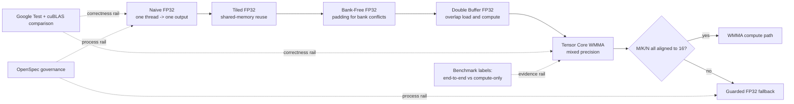

<div class="home-shell">
  <div class="home-hero-grid">
    <div>
      <p class="home-eyebrow">CUDA SGEMM ENGINEERING NOTEBOOK</p>
      <h1 class="home-main-title">SGEMM Optimization Lab</h1>
      <p class="home-main-subtitle">
        A bilingual CUDA SGEMM case study built for two outcomes: solid learning depth and strong interview storytelling.
        Every optimization step is tied to correctness constraints, benchmark evidence, and explicit validation boundaries.
      </p>
      <div class="home-action-row">
        <a class="btn" href="/en/getting-started">Start in 5 minutes</a>
        <a class="btn btn-outline" href="/en/project-highlights">See project highlights</a>
        <a class="btn btn-outline" href="/en/interview-playbook">Interview playbook</a>
        <a class="btn btn-outline" href="https://github.com/LessUp/sgemm-optimization">GitHub</a>
      </div>
      <div class="home-kicker-row">
        <span class="home-chip">cuBLAS-verified</span>
        <span class="home-chip">OpenSpec-governed</span>
        <span class="home-chip">EN / ZH mirrored</span>
      </div>
    </div>
    <div class="signal-grid">
      <div class="signal-card">
        <div class="signal-title">Kernel Ladder</div>
        <div class="signal-value">5</div>
        <div class="signal-note">naive -> tiled -> bank-free -> double-buffer -> WMMA</div>
      </div>
      <div class="signal-card">
        <div class="signal-title">Correctness Oracle</div>
        <div class="signal-value">cuBLAS</div>
        <div class="signal-note">separate tolerances for FP32 and Tensor Core paths</div>
      </div>
      <div class="signal-card">
        <div class="signal-title">Validation Boundary</div>
        <div class="signal-value">CI + GPU</div>
        <div class="signal-note">hosted CI for build health, local GPU for runtime and performance</div>
      </div>
      <div class="signal-card">
        <div class="signal-title">Public Surfaces</div>
        <div class="signal-value">EN / 中文</div>
        <div class="signal-note">mirrored pages for tutorial, interview, and references</div>
      </div>
    </div>
  </div>

  <div class="home-proof-strip">
    <div class="proof-grid">
      <div class="proof-item">
        <div class="proof-label">Benchmark Scope</div>
        <div class="proof-value">End-to-end and compute-only WMMA are reported separately.</div>
      </div>
      <div class="proof-item">
        <div class="proof-label">Numerical Policy</div>
        <div class="proof-value">FP32 and Tensor Core paths use different tolerance budgets by design.</div>
      </div>
      <div class="proof-item">
        <div class="proof-label">Engineering Contract</div>
        <div class="proof-value">Unified launcher signature keeps kernels swappable and testable.</div>
      </div>
      <div class="proof-item">
        <div class="proof-label">Governance</div>
        <div class="proof-value">OpenSpec keeps docs, process, and implementation intent aligned.</div>
      </div>
    </div>
  </div>
</div>

## Why this repository is worth attention

<div class="perf-grid">
  <div class="perf-card">
    <div class="perf-label">Learning Depth</div>
    <div class="perf-value">Progressive</div>
    <div class="perf-note">Each kernel stage teaches one specific performance concept.</div>
  </div>
  <div class="perf-card">
    <div class="perf-label">Evidence Model</div>
    <div class="perf-value">Traceable</div>
    <div class="perf-note">Speedup claims are attached to correctness checks and scope labels.</div>
  </div>
  <div class="perf-card">
    <div class="perf-label">Interview Utility</div>
    <div class="perf-value">Practical</div>
    <div class="perf-note">The project can be explained as a clear engineering decision chain.</div>
  </div>
  <div class="perf-card">
    <div class="perf-label">Community Value</div>
    <div class="perf-value">Reusable</div>
    <div class="perf-note">Includes playbooks, references, and architecture-aware tuning guidance.</div>
  </div>
</div>

## Project map in one diagram



## Choose your route

<div class="route-grid">
  <div class="route-card">
    <h3>Build and run quickly</h3>
    <p>Get from clone to benchmark execution with clear local-vs-CI expectations.</p>
    <div class="route-links">
      <a href="/en/getting-started">Getting Started</a>
      <a href="/en/benchmark-results">Benchmark Results</a>
    </div>
  </div>
  <div class="route-card">
    <h3>Learn the optimization ladder</h3>
    <p>Understand what each stage changes in memory behavior and performance profile.</p>
    <div class="route-links">
      <a href="/en/learning-path">Learning Path</a>
      <a href="/en/kernel-naive">Kernel Series</a>
    </div>
  </div>
  <div class="route-card">
    <h3>Prepare interview narrative</h3>
    <p>Use a concise storyline from architecture choices to measurable outcomes.</p>
    <div class="route-links">
      <a href="/en/project-highlights">Project Highlights</a>
      <a href="/en/interview-playbook">Interview Playbook</a>
    </div>
  </div>
  <div class="route-card">
    <h3>Validate technical lineage</h3>
    <p>Trace implementation choices to official docs, papers, and high-quality repos.</p>
    <div class="route-links">
      <a href="/en/references">References</a>
      <a href="/en/optimization-playbook">Optimization Playbook</a>
    </div>
  </div>
</div>

## Knowledge hub

<div class="knowledge-grid">
  <a class="knowledge-card" href="/en/project-highlights">
    <h3>Project Highlights</h3>
    <p>What differentiates this repository from many SGEMM demos, with proof-oriented framing.</p>
  </a>
  <a class="knowledge-card" href="/en/interview-playbook">
    <h3>Interview Playbook</h3>
    <p>A practical script for explaining architecture, benchmark trust, and trade-offs under pressure.</p>
  </a>
  <a class="knowledge-card" href="/en/references">
    <h3>References</h3>
    <p>Curated papers, official docs, and repositories mapped to concrete design decisions.</p>
  </a>
  <a class="knowledge-card" href="/en/optimization-playbook">
    <h3>Optimization Playbook</h3>
    <p>A diagnosis loop for bottleneck classification, hypothesis design, and measurable experiments.</p>
  </a>
  <a class="knowledge-card" href="/en/performance-casebook">
    <h3>Performance Casebook</h3>
    <p>Architecture-specific tuning priorities for Volta, Turing, Ampere, Ada, and Hopper.</p>
  </a>
  <a class="knowledge-card" href="/en/cuda-memory-cheatsheet">
    <h3>CUDA Memory Cheat Sheet</h3>
    <p>Coalescing, shared-memory banks, occupancy hints, and profiler-oriented reading checklist.</p>
  </a>
</div>

## Command cockpit

```bash
# Build
cmake -S . -B build -DCMAKE_BUILD_TYPE=Release
cmake --build build -j$(nproc)

# Validate
ctest --test-dir build
openspec validate --all

# Benchmark
./build/bin/sgemm_benchmark -a
./build/bin/sgemm_benchmark --dims 256 384 640
```

## Language and entry points

- Chinese mirrored home: [中文首页](/zh/)
- Repository entry: [README](https://github.com/LessUp/sgemm-optimization/blob/master/README.md)
- OpenSpec source of truth: [openspec/specs](https://github.com/LessUp/sgemm-optimization/tree/master/openspec/specs)
