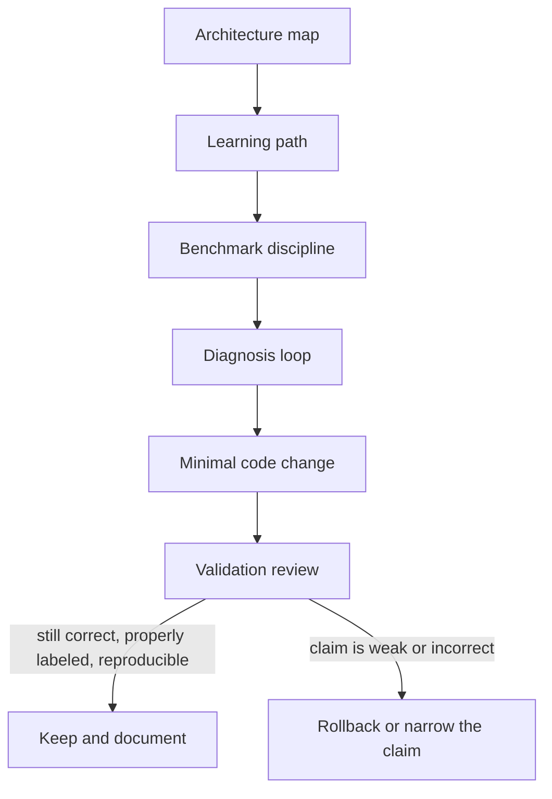

# Methodology

This section explains **how the repository is optimized**.

Architecture tells you why the kernels are arranged the way they are. Methodology tells you how to study that ladder, isolate bottlenecks, and turn one observation into one defensible change. Validation then tells you which claims survive correctness checks, scope labeling, and reproducibility review.

## What belongs here

| Topic | Why it lives in Methodology | Canonical page |
|------|------|------|
| Learning the kernel ladder in order | The reader needs a staged path before tuning details make sense | [Learning Path](/en/learning-path) |
| Running disciplined experiments | Experiment design is part of the optimization workflow | [Benchmark Discipline](/en/methodology/benchmark-discipline) |
| Diagnosing bottlenecks and choosing the next hypothesis | This is the core optimization loop | [Diagnosis Loop](/en/methodology/diagnosis-loop) |
| Per-kernel implementation detail | These pages explain what each optimization stage changes | [Kernel pages](/en/kernel-naive) |

## Methodology map

## Working rules

1. **Learn the ladder in order.** Start from the architectural map and the kernel progression before touching WMMA-specific conclusions.
2. **Change one thing at a time.** A single benchmark cycle should validate one hypothesis, not a bundle of unrelated edits.
3. **Use local GPU evidence early.** Diagnosis without runtime evidence usually misclassifies the bottleneck.
4. **Hand every speedup to Validation.** A gain only counts after correctness, scope, and reproducibility are re-checked.

## Interview-ready framing

Use this structure when you need to explain the project concisely in a review or interview:

1. **Problem framing** — SGEMM is a useful proxy for memory hierarchy, parallel mapping, and mixed-precision trade-offs.
2. **Optimization ladder** — each kernel changes one bottleneck class at a time.
3. **Correctness and trust model** — cuBLAS is the oracle, tolerances differ between FP32 and WMMA, and unsupported WMMA shapes fall back explicitly.
4. **Measurement discipline** — end-to-end and compute-only numbers are separated, and hosted CI is kept separate from local GPU proof.
5. **Engineering maturity** — unified launcher interfaces, RAII/error handling, mirrored docs, and OpenSpec governance show the work is maintained deliberately.

### High-value deep-dive questions

- **Why not just use cuBLAS?** Production code should, but this repository exists to demonstrate bottleneck diagnosis and defensible optimization reasoning.
- **Why is the Tensor Core path still behind cuBLAS?** The WMMA path here is educational and intentionally exposes staging, alignment, and fallback costs instead of hiding them behind a production-tuned stack.
- **How do you know the performance claims are trustworthy?** The project checks correctness first, labels benchmark scope explicitly, and separates CI-safe checks from local GPU runtime evidence.
- **What would you improve next for production work?** Architecture-specific launch tuning, deeper WMMA overlap, stronger profiler evidence, and CUTLASS-style maintainable kernels.

## Read this section in order

1. [Learning Path](/en/learning-path)
2. [Benchmark Discipline](/en/methodology/benchmark-discipline)
3. [Diagnosis Loop](/en/methodology/diagnosis-loop)
4. [Validation Overview](/en/validation/)
