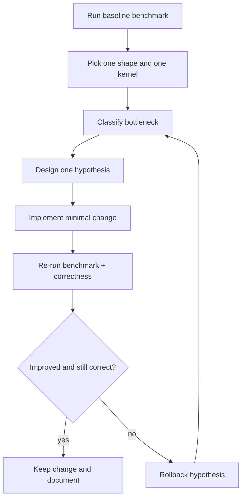

# Optimization Playbook

A practical diagnosis loop for SGEMM performance bottlenecks


## End-to-end optimization loop



Use one loop per hypothesis. If you change five things at once, you learn nothing.


## Experiment templates

### Template A: isolate one shape

```bash
./build/bin/sgemm_benchmark --dims 1024 1024 1024
```

Use this when you want to remove shape noise and focus on one bottleneck.

### Template B: sweep shape diversity

```bash
./build/bin/sgemm_benchmark -a
```

Use this to detect regressions that only appear on awkward dimensions.

### Template C: longer measurements

```bash
./build/bin/sgemm_benchmark -a --warmup 10 --benchmark 50
```

Use this before making a final claim in docs or PRs.


## Quality gate before claiming a speedup

- Re-run `ctest --test-dir build` and keep cuBLAS comparison clean.
- Compare both a canonical shape (`1024 x 1024 x 1024`) and at least one irregular shape.
- Report whether the number is end-to-end or compute-only.
- Keep the kernel launcher contract unchanged unless there is a strong reason.

---
