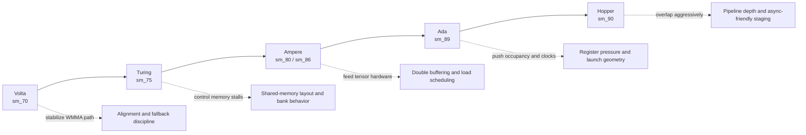

# Performance Casebook

Architecture-aware SGEMM tuning notes from Volta to Hopper

## One map from architecture to tuning focus

## Practical case patterns

### Case A: Tensor Core slower than expected on Volta/Turing

**Signal**  
`WMMA end-to-end` is close to, or below, FP32 kernels.

**Likely causes**
- Dimensions are frequently non-16-aligned, forcing fallback behavior.
- Conversion and wrapper overhead are larger than expected workload gain.

**Actions**
1. Benchmark one aligned shape and one irregular shape side by side.
2. Compare `WMMA compute-only` and `WMMA end-to-end` explicitly.
3. Keep fallback path unchanged while tuning conversion/staging boundaries.

### Case B: Ampere/Ada gains stall after tiled kernel

**Signal**  
`Tiled` improves clearly, but `Double Buffer` and `Tensor Core` gains are weak.

**Likely causes**
- Stage overlap is incomplete.
- Register pressure reduces active warps.

**Actions**
1. Try a smaller block/tile configuration to recover occupancy.
2. Check whether additional stages increase total time instead of reducing it.
3. Validate that correctness still matches cuBLAS after each launch change.

### Case C: Hopper compute-only looks strong but end-to-end remains flat

**Signal**  
`WMMA compute-only` scales, while full pipeline speedup is limited.

**Likely causes**
- Data movement or conversion flow dominates.
- Benchmark setup underestimates pipeline warmup effects.

**Actions**
1. Increase warmup and benchmark iterations for stable timing windows.
2. Profile conversion and launch overhead as a separate segment.
3. Tune overlap strategy before touching micro-level compute code.

## Reporting rules for trustworthy comparisons

- Always report GPU model, CUDA version, and whether numbers are end-to-end or compute-only.
- Never compare aligned-only numbers to mixed-shape baselines without labeling scope.
- Keep cuBLAS verification and tolerance policy unchanged while tuning performance.

---
