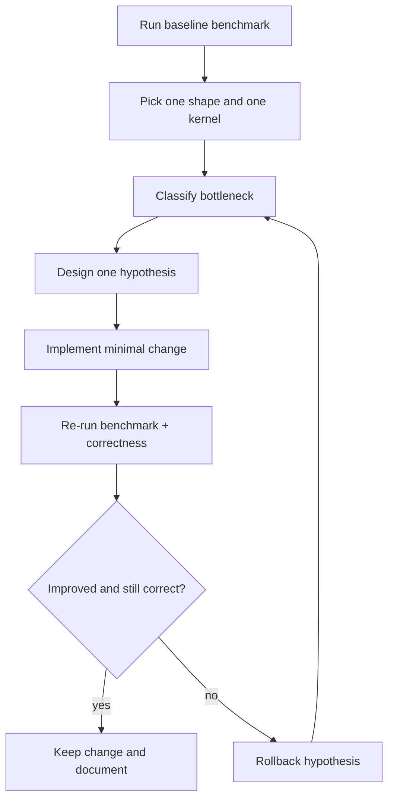

# Optimization Playbook
{: .fs-8 }

A practical diagnosis loop for SGEMM performance bottlenecks
{: .fs-6 .fw-300 }

---

## Why this page exists

The repository gives you five kernels and reproducible benchmark commands, but optimization work still needs a method.
This page turns that method into a reusable loop so you can avoid random tuning.

---

## End-to-end optimization loop



Use one loop per hypothesis. If you change five things at once, you learn nothing.

---

## Bottleneck signal map

| Signal from benchmark or profiler | Likely bottleneck | First experiment |
|----------------------------------|-------------------|------------------|
| Naive and tiled are too close | Shared-memory reuse is not effective yet | Verify tile load/store index math and occupancy |
| Tiled improves but bank-free barely moves | Bank conflict is not the dominant limiter | Measure global memory throughput first |
| Double buffer has no gain | Latency overlap is not happening | Check stage scheduling and register pressure |
| Tensor Core end-to-end < FP32 kernels | Conversion/fallback overhead dominates | Split end-to-end vs compute-only and compare |
| Compute-only WMMA grows fast but end-to-end does not | Data movement pipeline is the limiter | Inspect host/device conversion and launch flow |

---

## Experiment templates

### Template A: isolate one shape

```bash
./build/bin/sgemm_benchmark --dims 1024 1024 1024
```

Use this when you want to remove shape noise and focus on one bottleneck.

### Template B: sweep shape diversity

```bash
./build/bin/sgemm_benchmark -a
```

Use this to detect regressions that only appear on awkward dimensions.

### Template C: longer measurements

```bash
./build/bin/sgemm_benchmark -a --warmup 10 --benchmark 50
```

Use this before making a final claim in docs or PRs.

---

## Profiler metric hints

| Question | Nsight Compute metric hint |
|----------|----------------------------|
| Are we bandwidth-bound? | `dram__throughput.avg.pct_of_peak_sustained_elapsed` |
| Are SMs underutilized? | `sm__throughput.avg.pct_of_peak_sustained_elapsed` |
| Are shared-memory bank conflicts high? | `l1tex__data_bank_conflicts_pipe_lsu_mem_shared_op_ld.sum` |
| Is occupancy unexpectedly low? | `sm__warps_active.avg.pct_of_peak_sustained_active` |

Do not optimize from one metric in isolation. Always cross-check with elapsed time and correctness.

---

## Quality gate before claiming a speedup

- Re-run `ctest --test-dir build` and keep cuBLAS comparison clean.
- Compare both a canonical shape (`1024 x 1024 x 1024`) and at least one irregular shape.
- Report whether the number is end-to-end or compute-only.
- Keep the kernel launcher contract unchanged unless there is a strong reason.

---

## Related pages

- [Learning Path](learning-path/)
- [Benchmark Results](benchmark-results/)
- [CUDA Memory Cheat Sheet](cuda-memory-cheatsheet/)
