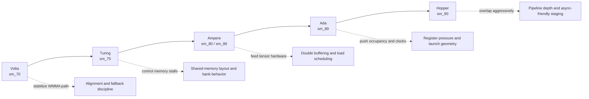

# Performance Casebook
{: .fs-8 }

Architecture-aware SGEMM tuning notes from Volta to Hopper
{: .fs-6 .fw-300 }

---

## Why this casebook exists

The same SGEMM kernel can behave very differently across GPU generations.  
This page gives a compact "what to try first" map so you can tune with intent, not guesswork.

---

## One map from architecture to tuning focus



---

## Architecture strategy table

| Architecture | Typical behavior in this repository | First tuning priorities | High-risk anti-pattern |
|--------------|-------------------------------------|-------------------------|------------------------|
| Volta (`sm_70`) | WMMA works but alignment constraints quickly dominate outcomes | Validate 16-aligned dimensions, keep fallback explicit, measure end-to-end vs compute-only separately | Claiming Tensor Core gains without shape discipline |
| Turing (`sm_75`) | FP32 path often memory-sensitive before compute saturates | Improve coalescing, check bank conflicts, keep tile math simple and verifiable | Chasing instruction tweaks before fixing memory layout |
| Ampere (`sm_80` / `sm_86`) | Tensor path can jump, but staging quality decides realized gains | Tune double buffer stages, control register usage, compare several block sizes | Over-expanding per-thread state and collapsing occupancy |
| Ada (`sm_89`) | High clock headroom rewards balanced pipelines | Re-check launch geometry, warmup/benchmark windows, and shape diversity | Publishing one-shape wins as universal improvements |
| Hopper (`sm_90`) | Pipeline overlap becomes more decisive than isolated kernel math | Prioritize data movement overlap, keep conversion overhead visible, benchmark with longer runs | Optimizing compute-only path while end-to-end remains bottlenecked |

---

## Practical case patterns

### Case A: Tensor Core slower than expected on Volta/Turing

**Signal**  
`WMMA end-to-end` is close to, or below, FP32 kernels.

**Likely causes**
- Dimensions are frequently non-16-aligned, forcing fallback behavior.
- Conversion and wrapper overhead are larger than expected workload gain.

**Actions**
1. Benchmark one aligned shape and one irregular shape side by side.
2. Compare `WMMA compute-only` and `WMMA end-to-end` explicitly.
3. Keep fallback path unchanged while tuning conversion/staging boundaries.

### Case B: Ampere/Ada gains stall after tiled kernel

**Signal**  
`Tiled` improves clearly, but `Double Buffer` and `Tensor Core` gains are weak.

**Likely causes**
- Stage overlap is incomplete.
- Register pressure reduces active warps.

**Actions**
1. Try a smaller block/tile configuration to recover occupancy.
2. Check whether additional stages increase total time instead of reducing it.
3. Validate that correctness still matches cuBLAS after each launch change.

### Case C: Hopper compute-only looks strong but end-to-end remains flat

**Signal**  
`WMMA compute-only` scales, while full pipeline speedup is limited.

**Likely causes**
- Data movement or conversion flow dominates.
- Benchmark setup underestimates pipeline warmup effects.

**Actions**
1. Increase warmup and benchmark iterations for stable timing windows.
2. Profile conversion and launch overhead as a separate segment.
3. Tune overlap strategy before touching micro-level compute code.

---

## Minimal architecture-aware benchmark matrix

Use this matrix before making cross-architecture claims:

```text
Shape set:
- 1024 x 1024 x 1024  (canonical aligned)
- 1536 x 768  x 2048  (mixed aspect ratio)
- 1000 x 1000 x 1000  (non-16 aligned stress)

Command set:
- ./build/bin/sgemm_benchmark -a
- ./build/bin/sgemm_benchmark --dims M K N
- ./build/bin/sgemm_benchmark -a --warmup 10 --benchmark 50
```

---

## Reporting rules for trustworthy comparisons

- Always report GPU model, CUDA version, and whether numbers are end-to-end or compute-only.
- Never compare aligned-only numbers to mixed-shape baselines without labeling scope.
- Keep cuBLAS verification and tolerance policy unchanged while tuning performance.

---

## Related pages

- [Benchmark Results](benchmark-results/)
- [Optimization Playbook](optimization-playbook/)
- [CUDA Memory Cheat Sheet](cuda-memory-cheatsheet/)
