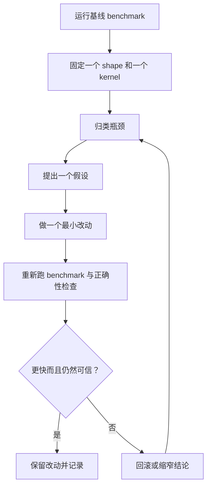

# 诊断闭环

一个实用的 SGEMM 调优闭环，必须把观察、假设与验证分开。

## 端到端优化闭环

一次闭环只服务一个假设。闭环之所以刻意做小，是为了获得学习，而不是制造动作感。

## 瓶颈归类启发

| 信号 | 常见瓶颈 | 第一检查点 |
|------|----------|------------|
| 从 Naive 到 Tiled 提升很大，后续增益变平 | 数据移动仍然主导 | 共享内存复用与全局访存模式 |
| Tiled 有提升，Bank-Free 继续提升 | 共享内存 bank 冲突确实存在 | 共享内存布局与 bank 映射 |
| Double Buffer 提升不如预期 | 重叠不充分或占用率下降 | 寄存器压力、stage 数量、launch 几何 |
| WMMA compute-only 很好，端到端不好 | 转换、staging 或 fallback 开销主导 | FP32→FP16 staging 与快路径 guard |
| 不规则 shape 回退明显 | 对齐假设过强 | fallback 路径与 shape-sensitive guard |

## 架构感知案例模式

### 案例 A：Volta/Turing 上 Tensor Core 不如预期

**信号**  
`WMMA 端到端` 接近甚至低于 FP32 kernel。

**常见原因**
- 维度经常不是 16 对齐，fallback 行为占了主导。
- 转换与 wrapper 开销吃掉了计算收益。

**建议动作**
1. 并排比较一个 16 对齐 shape 和一个不规则 shape。
2. `WMMA compute-only` 与 `WMMA 端到端` 必须一起读，不能单独解释。
3. 调整 staging 边界时，先保持 fallback 路径不变。

### 案例 B：Ampere/Ada 在 Tiled 之后增益停滞

**信号**  
`Tiled` 提升明显，但 `Double Buffer` 与 `Tensor Core` 增益偏弱。

**常见原因**
- 更多 stage 并没有形成足够重叠。
- 寄存器压力过高，活跃 warp 下降。

**建议动作**
1. 先尝试更小的 block 或 tile 形状。
2. 检查更多 stage 是否反而抬高总耗时。
3. 每次调整 launch 几何后都重新跑正确性。

### 案例 C：Hopper 上 compute-only 在涨，端到端不动

**信号**  
`WMMA compute-only` 明显变强，但完整流程几乎不动。

**常见原因**
- 数据搬运或转换流程占据了总时间。
- benchmark 窗口太短，流水线没有稳定下来。

**建议动作**
1. 提高 warmup 与 benchmark 轮次。
2. 把转换与 launch 开销拆出来单独分析。
3. 先优化重叠策略，再动微观算术细节。

## 何时停止闭环

满足以下条件后，就应该把结论交给 [验证](/zh/validation/)：

- 速度提升通过 `ctest --test-dir build`
- 结果带有正确的 benchmark 范围标注
- shape 覆盖与声称的结论一致
- 命令与环境信息足够让别人复现

任何一项不成立时，最合理的动作通常是回滚，而不是补解释。
