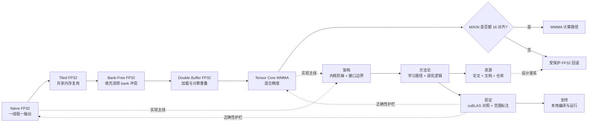

  

    

      
CUDA SGEMM 白皮书首页

      <h1 class="home-main-title">把 SGEMM 讲成一条技术论证链</h1>
      

        本站把 SGEMM 项目解释为一条完整的工程论证链：从简单的 CUDA 矩阵乘法基线出发，沿着分阶段架构演进一路向上，
        只有当正确性对照、benchmark 范围标注和验证边界同时成立时，性能结论才算站得住。架构、方法论、资源、
        验证与支持被组织成同一个知识模型，让第一次接触仓库的技术读者仅凭首页就能看懂实现阶梯与证据模型。
      

      

        <a class="btn" href="/zh/architecture/">先看架构图谱</a>
        <a class="btn btn-outline" href="/zh/methodology/">按方法论阅读</a>
        <a class="btn btn-outline" href="/zh/validation/">查看验证边界</a>
        <a class="btn btn-outline" href="https://github.com/LessUp/sgemm-optimization">GitHub</a>
      

      

        5 级内核阶梯
        cuBLAS 锚定证据
        中英镜像结构
      

    

    

      

        
核心问题

        
每个 kernel 为什么会更快？

        
每一步复杂度的增加，都应该对应内存行为或执行形态的可解释变化。

      

      

        
证据模型

        
cuBLAS + 范围标注

        
正确性对照和 benchmark 标注让结论可解释，而不是只剩宣传口径。

      

      

        
验证边界

        
CI 不是 GPU

        
托管自动化证明构建与结构健康，本地硬件才证明运行时与性能行为。

      

      

        
读者模型

        
5 个规范域

        
架构、方法论、资源、验证、支持，共同构成站点的顶层地图。

      

    

  

  

    

      

        
论点

        
这个仓库关心的是“为什么这些优化成立”，而不只是“做了多少个 kernel”。

      

      

        
方法

        
一层优化对应一次瓶颈转移，也对应一次更清楚的技术解释。

      

      

        
工程契约

        
统一 launcher 形态与受保护的 WMMA fallback，让各个 kernel 可以互换、可比较、可验证。

      

      

        
结果

        
首次进入的读者可以从架构、方法论、资源、验证或支持任一入口进入，而不会丢失技术主线。

      

    

  

## 论点与定位

这个首页是整套白皮书式文档的入口。项目不再被呈现为功能列表，也不被包装成单纯的 benchmark 展示板；它被组织为一串关于 CUDA SGEMM 的技术主张，而每个主张都必须能回到实现结构、优化意图与验证证据上。

站点的知识模型是刻意外显的：

- **架构**：说明内核阶梯里有什么、各阶段如何衔接、接口约束在哪里。
- **方法论**：说明如何阅读、学习和调优这条阶梯，而不是跳过每一步背后的逻辑。
- **资源**：把设计选择回溯到论文、官方文档和高价值仓库。
- **验证**：解释证据代表什么、benchmark 标签代表什么、信任边界在哪里结束。
- **支持**：帮助读者从 clone 到本地验证，且明确 CI 与 GPU 证明能力的差异。

## 为什么这很重要

  

    
可解释性

    
清楚

    
第一次阅读的人也能看出 kernel 之间到底改了什么，以及为什么这些变化值得关注。

  

  

    
可迁移性

    
可复用

    
分阶段叙述让这个 SGEMM 实现同时成为可复用的 CUDA 优化案例。

  

  

    
Benchmark 诚实度

    
有范围

    
WMMA 端到端与仅计算路径被明确拆开，读者可以知道每个数字究竟证明了什么。

  

  

    
信任模型

    
外显

    
首页会先说明哪些结论由托管文档/治理自动化检查，哪些结论必须依赖真实 GPU 机器。

  

## 架构全景图

项目围绕一条渐进式内核阶梯展开，但这条阶梯之所以有意义，是因为正确性护栏、benchmark 标注和流程治理始终挂在同一条主线上。

## 方法论入口

  

    <h3>我先需要全局视角</h3>
    
先从仓库的系统视图入手，再用验证语境理解这些架构结论到底可以声称什么。

    

      <a href="/zh/architecture/">架构说明</a>
      <a href="/zh/validation/">验证概览</a>
    

  

  

    <h3>我想按顺序学完整个优化阶梯</h3>
    
当你希望每个性能概念都建立在前一个 kernel 之上，而不是直接跳到 WMMA 时，请走这条路径。

    

      <a href="/zh/learning-path">学习路径</a>
      <a href="/zh/architecture/">架构概览</a>
    

  

  

    <h3>我需要调优启发和延展材料</h3>
    
把方法论与资源入口配合使用，可以同时获得可执行的优化建议和对应的技术来源。

    

      <a href="/zh/methodology/diagnosis-loop">诊断闭环</a>
      <a href="/zh/references">参考文献</a>
    

  

  

    <h3>我想复现或审查这些结论</h3>
    
把支持与验证入口放在一起看，能快速弄清楚本地该跑什么、CI 已经证明了什么，以及结果应如何解读。

    

      <a href="/zh/getting-started">快速上手</a>
      <a href="/zh/validation/">验证概览</a>
    

  

## 资源总入口

  <a class="knowledge-card" href="/zh/architecture/">
    <h3>架构</h3>
    
系统梳理内核阶梯、接口边界，以及维系实现一致性的关键设计约束。

  </a>
  <a class="knowledge-card" href="/zh/methodology/">
    <h3>方法论</h3>
    
规范的优化工作流入口：把阶段学习、benchmark 纪律与诊断逻辑重新系到架构主线上。

  </a>
  <a class="knowledge-card" href="/zh/references">
    <h3>资源</h3>
    
把项目背后的官方文档、论文与成熟仓库映射回具体设计选择。

  </a>
  <a class="knowledge-card" href="/zh/validation/">
    <h3>验证</h3>
    
集中解释正确性容差、benchmark 范围、fallback 行为，以及公开数字真正代表的含义。

  </a>
  <a class="knowledge-card" href="/zh/getting-started">
    <h3>支持</h3>
    
承接 clone、构建、测试与运行流程，并提前说明本地验证与托管 CI 的职责差异。

  </a>

## 验证边界

验证模型被刻意拆分，目的就是避免读者高估托管自动化，也避免低估本地 GPU 证据的重要性。

| 证据表面 | 能证明什么 | 在哪里运行 |
|----------|------------|------------|
| 文档、Pages 与治理检查 | 规范、文档结构、流程一致性，以及 Pages 可发布性 | 托管 CI 与本地 CLI |
| Google Test + cuBLAS 对照 | 以项目 oracle 为基准的运行时正确性 | 本地 GPU 机器 |
| Benchmark 执行 | 性能行为、WMMA 范围差异、fallback 代价 | 本地 GPU 机器 |

这条边界是首页的一级概念，而不是脚注：CI 负责让仓库保持健康，只有本地 GPU 执行才能验证运行时行为和性能主张。

## 规范入口

- English mirrored home: [English Home](/en/)
- 仓库入口： [README](https://github.com/LessUp/sgemm-optimization/blob/master/README.zh-CN.md)
- 稳定流程与需求来源： [openspec/specs](https://github.com/LessUp/sgemm-optimization/tree/master/openspec/specs)
