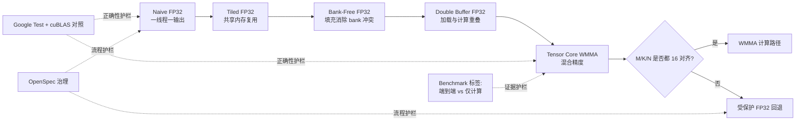

<div class="home-shell">
  <div class="home-hero-grid">
    <div>
      <p class="home-eyebrow">CUDA SGEMM 架构指南</p>
      <h1 class="home-main-title">SGEMM 架构白皮书</h1>
      <p class="home-main-subtitle">
        这是一个围绕架构拆解、优化方法、验证证据与工程参考资料组织的双语 CUDA SGEMM 指南。
        每一步提速都绑定正确性约束、基准解释和可复现的验证路径。
      </p>
      <div class="home-action-row">
        <a class="btn" href="/zh/getting-started">5 分钟开始</a>
        <a class="btn btn-outline" href="/zh/architecture">查看架构图谱</a>
        <a class="btn btn-outline" href="/zh/learning-path">学习路径</a>
        <a class="btn btn-outline" href="https://github.com/LessUp/sgemm-optimization">GitHub</a>
      </div>
      <div class="home-kicker-row">
        <span class="home-chip">cuBLAS 对照</span>
        <span class="home-chip">OpenSpec 治理</span>
        <span class="home-chip">中英镜像页面</span>
      </div>
    </div>
    <div class="signal-grid">
      <div class="signal-card">
        <div class="signal-title">内核阶梯</div>
        <div class="signal-value">5</div>
        <div class="signal-note">naive -> tiled -> bank-free -> double-buffer -> WMMA</div>
      </div>
      <div class="signal-card">
        <div class="signal-title">正确性基准</div>
        <div class="signal-value">cuBLAS</div>
        <div class="signal-note">FP32 与 Tensor Core 使用不同容差预算</div>
      </div>
      <div class="signal-card">
        <div class="signal-title">验证边界</div>
        <div class="signal-value">CI + GPU</div>
        <div class="signal-note">CI 保证构建健康，本地 GPU 验证运行时与性能</div>
      </div>
      <div class="signal-card">
        <div class="signal-title">公开内容</div>
        <div class="signal-value">EN / 中文</div>
        <div class="signal-note">教程、面试、参考资料均中英对照</div>
      </div>
    </div>
  </div>

  <div class="home-proof-strip">
    <div class="proof-grid">
      <div class="proof-item">
        <div class="proof-label">Benchmark 范围</div>
        <div class="proof-value">WMMA 端到端与仅计算路径分开汇报，避免混淆。</div>
      </div>
      <div class="proof-item">
        <div class="proof-label">数值策略</div>
        <div class="proof-value">FP32 与 Tensor Core 按路径设定不同精度容差。</div>
      </div>
      <div class="proof-item">
        <div class="proof-label">工程契约</div>
        <div class="proof-value">统一 launcher 形态保证 kernel 可替换、可对比、可验证。</div>
      </div>
      <div class="proof-item">
        <div class="proof-label">治理一致性</div>
        <div class="proof-value">OpenSpec 持续对齐文档、流程与实现意图。</div>
      </div>
    </div>
  </div>
</div>

## 为什么这个项目值得关注

<div class="perf-grid">
  <div class="perf-card">
    <div class="perf-label">学习深度</div>
    <div class="perf-value">渐进式</div>
    <div class="perf-note">每个内核阶段只解决一个核心性能问题。</div>
  </div>
  <div class="perf-card">
    <div class="perf-label">证据模型</div>
    <div class="perf-value">可追踪</div>
    <div class="perf-note">性能结论绑定正确性验证与范围标注。</div>
  </div>
  <div class="perf-card">
    <div class="perf-label">面试价值</div>
    <div class="perf-value">可讲清</div>
    <div class="perf-note">可以按工程决策链条讲出“为什么这样做”。</div>
  </div>
  <div class="perf-card">
    <div class="perf-label">社区价值</div>
    <div class="perf-value">可复用</div>
    <div class="perf-note">包含调优手册、架构案例与参考文献索引。</div>
  </div>
</div>

## 一张图看项目全貌



## 按目标选择入口

<div class="route-grid">
  <div class="route-card">
    <h3>快速编译与运行</h3>
    <p>从 clone 到 benchmark，明确本地验证与 CI 验证分工。</p>
    <div class="route-links">
      <a href="/zh/getting-started">快速上手</a>
      <a href="/zh/benchmark-results">Benchmark 结果</a>
    </div>
  </div>
  <div class="route-card">
    <h3>系统学习优化阶梯</h3>
    <p>按顺序理解每一步如何改变内存行为与性能画像。</p>
    <div class="route-links">
      <a href="/zh/learning-path">学习路径</a>
      <a href="/zh/kernel-naive">内核系列</a>
    </div>
  </div>
  <div class="route-card">
    <h3>追踪架构决策</h3>
    <p>把设计取舍、内核阶段和 benchmark 证据串成一条可核查的技术主线。</p>
    <div class="route-links">
      <a href="/zh/architecture">架构说明</a>
      <a href="/zh/benchmark-results">Benchmark 结果</a>
    </div>
  </div>
  <div class="route-card">
    <h3>追溯技术来源</h3>
    <p>从实现选择反查到官方文档、论文和高质量开源仓库。</p>
    <div class="route-links">
      <a href="/zh/references">参考文献</a>
      <a href="/zh/optimization-playbook">优化手册</a>
    </div>
  </div>
</div>

## 知识补给站

<div class="knowledge-grid">
  <a class="knowledge-card" href="/zh/architecture">
    <h3>架构说明</h3>
    <p>集中梳理内核阶梯、验证边界与关键设计约束，帮助快速建立全局视角。</p>
  </a>
  <a class="knowledge-card" href="/zh/learning-path">
    <h3>学习路径</h3>
    <p>按优化阶梯组织阅读顺序，让每一个性能概念都建立在前一步之上。</p>
  </a>
  <a class="knowledge-card" href="/zh/references">
    <h3>参考文献</h3>
    <p>按用途整理论文、官方文档和仓库，并映射到具体设计决策。</p>
  </a>
  <a class="knowledge-card" href="/zh/optimization-playbook">
    <h3>优化手册</h3>
    <p>给出瓶颈归类、假设验证、实验记录的闭环方法。</p>
  </a>
  <a class="knowledge-card" href="/zh/performance-casebook">
    <h3>性能案例库</h3>
    <p>按 Volta、Turing、Ampere、Ada、Hopper 总结调优优先级。</p>
  </a>
  <a class="knowledge-card" href="/zh/cuda-memory-cheatsheet">
    <h3>CUDA 内存速查表</h3>
    <p>内存合并访问、bank 行为、占用率与 profiler 指标快速对照。</p>
  </a>
</div>

## 命令驾驶舱

```bash
# 编译
cmake -S . -B build -DCMAKE_BUILD_TYPE=Release
cmake --build build -j$(nproc)

# 验证
ctest --test-dir build
openspec validate --all

# 基准测试
./build/bin/sgemm_benchmark -a
./build/bin/sgemm_benchmark --dims 256 384 640
```

## 语言与入口

- English mirrored home: [English Home](/en/)
- 仓库入口: [README](https://github.com/LessUp/sgemm-optimization/blob/master/README.zh-CN.md)
- OpenSpec 权威规范: [openspec/specs](https://github.com/LessUp/sgemm-optimization/tree/master/openspec/specs)
