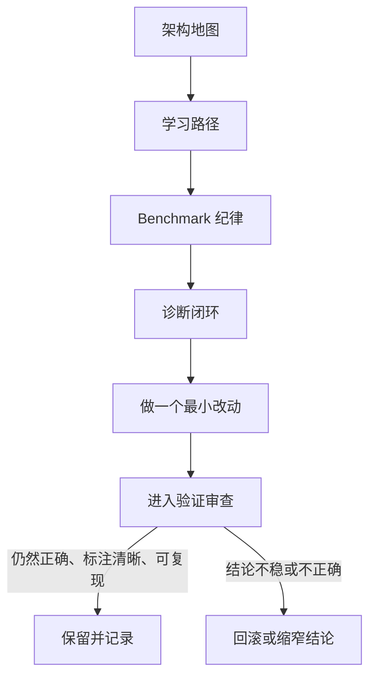

# 方法论

本章节解释**我们如何做优化**。

架构章节回答“为什么 kernel 会按这种方式组织”。方法论回答“如何沿着这条阶梯学习、定位瓶颈、把一次观察变成一次可辩护的改动”。随后再由验证章节判断这些结论是否通过了正确性、范围标注与可复现性审查。

## 哪些内容属于这里

| 主题 | 为什么放在方法论 | 规范入口 |
|------|------|------|
| 按顺序理解 kernel 阶梯 | 没有分阶段学习路径，后续调优细节会失去上下文 | [学习路径](/zh/learning-path) |
| 设计有纪律的实验 | 实验设计本身就是优化流程的一部分 | [Benchmark 纪律](/zh/methodology/benchmark-discipline) |
| 诊断瓶颈并决定下一个假设 | 这是优化工作的核心闭环 | [诊断闭环](/zh/methodology/diagnosis-loop) |
| 各个 kernel 的实现细节 | 这些页面解释每一级具体改了什么 | [Kernel 页面](/zh/kernel-naive) |

## 方法论地图

## 工作规则

1. **按阶梯顺序学习。** 先建立架构地图与 kernel 演进，再解释 WMMA 结论。
2. **一次只改一件事。** 一次 benchmark 循环只验证一个假设，而不是一揽子改动。
3. **尽早使用本地 GPU 证据。** 没有运行时证据的诊断，通常会误判瓶颈。
4. **所有提速都必须交给验证章节。** 只有重新通过正确性、范围与可复现性审查后，速度提升才算成立。

## 面试与评审时的讲述框架

当你需要在评审或面试里快速说明这个项目时，建议按下面的顺序组织：

1. **问题定义** —— SGEMM 是理解内存层级、并行映射和混合精度权衡的高价值代理问题。
2. **优化阶梯** —— 每一级 kernel 只针对一种瓶颈类别做改变。
3. **正确性与可信度模型** —— 以 cuBLAS 为 oracle，FP32 与 WMMA 使用不同容差，WMMA 不满足条件时显式回退。
4. **测量纪律** —— 区分端到端与 compute-only，并把托管 CI 与本地 GPU 证据严格分开。
5. **工程成熟度** —— 统一 launcher 接口、RAII/异常处理、双语镜像文档和 OpenSpec 治理共同说明这是被认真维护的工程案例。

### 高价值追问与回答框架

- **既然有 cuBLAS，为什么还做这个？** 生产场景当然优先用 cuBLAS，但这个仓库的目标是展示如何定位瓶颈、验证结论，并把优化讲清楚。
- **为什么 Tensor Core 路径仍然落后于 cuBLAS？** 这里的 WMMA 实现是教学型路径，刻意保留 staging、对齐与 fallback 成本，而不是把它们隐藏在生产级调优栈里。
- **你怎么证明性能结论可信？** 先过正确性，再标清 benchmark 范围，并把 CI 可验证内容与本地 GPU 运行时证据分开。
- **如果要继续做成生产项目，下一步会是什么？** 架构特化 launch 调优、更深的 WMMA overlap、更完整的 profiler 证据，以及更可维护的 CUTLASS 风格内核方案。

## 建议阅读顺序

1. [学习路径](/zh/learning-path)
2. [Benchmark 纪律](/zh/methodology/benchmark-discipline)
3. [诊断闭环](/zh/methodology/diagnosis-loop)
4. [验证概览](/zh/validation/)
