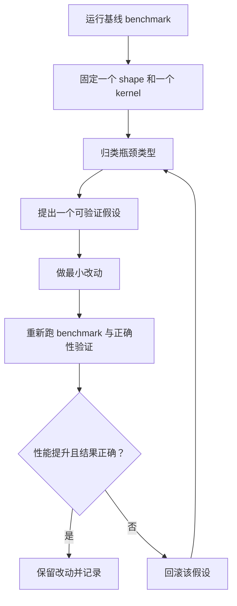

# 优化实战手册

面向 SGEMM 性能瓶颈的实用诊断闭环


## 端到端优化闭环



一次循环只验证一个假设。一次改五件事，通常学不到任何结论。


## 实验模板

### 模板 A：固定单一 shape

```bash
./build/bin/sgemm_benchmark --dims 1024 1024 1024
```

适用于去掉 shape 噪声，只聚焦一个瓶颈。

### 模板 B：覆盖多种 shape

```bash
./build/bin/sgemm_benchmark -a
```

适用于发现只在特殊维度触发的回归。

### 模板 C：延长测量窗口

```bash
./build/bin/sgemm_benchmark -a --warmup 10 --benchmark 50
```

适用于在文档或 PR 中给出最终性能结论之前复核。


## 声称提速前的质量门

- 重新运行 `ctest --test-dir build`，确认与 cuBLAS 对照通过。
- 同时比较标准 shape（`1024 x 1024 x 1024`）与至少一个不规则 shape。
- 明确标注结果是端到端还是仅计算。
- 除非有强理由，不要破坏统一 kernel launcher 契约。

---
