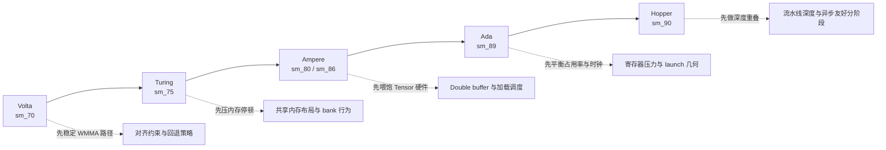

# 性能案例库

从 Volta 到 Hopper 的架构感知 SGEMM 调优笔记

## 一张图看架构与调优重点

## 典型案例模式

### 案例 A：Volta/Turing 上 Tensor Core 提升不明显

**信号**  
`WMMA 端到端` 与 FP32 kernel 接近，甚至更低。

**常见原因**
- 大量维度不是 16 对齐，频繁触发 fallback。
- 转换与 wrapper 开销抵消了计算收益。

**建议动作**
1. 同时测一个 16 对齐 shape 和一个不规则 shape。
2. 明确对比 `WMMA 仅计算` 与 `WMMA 端到端`。
3. 调优转换/分阶段边界时，保持 fallback 行为不变。

### 案例 B：Ampere/Ada 在 tiled 之后增益停滞

**信号**  
`Tiled` 提升明显，但 `Double Buffer` 与 `Tensor Core` 增益有限。

**常见原因**
- 阶段重叠不完整。
- 寄存器压力过高，活跃 warp 降低。

**建议动作**
1. 先尝试更小的 block/tile 组合，恢复占用率。
2. 检查增加阶段后总耗时是否反而上升。
3. 每次 launch 参数调整后都重新对照 cuBLAS 正确性。

### 案例 C：Hopper 上 compute-only 很强，端到端不动

**信号**  
`WMMA 仅计算` 提升明显，但完整流程速度几乎不变。

**常见原因**
- 数据搬运或转换流程占主导。
- benchmark 设置对流水线预热不够友好。

**建议动作**
1. 提高 warmup 与 benchmark 轮次，先稳定测量窗口。
2. 单独分析转换与 launch 开销段。
3. 先优化重叠策略，再动微观算术内核细节。

## 保持结论可信的汇报规则

- 必须给出 GPU 型号、CUDA 版本，并标注结果是端到端还是仅计算。
- 不要把 “仅对齐 shape” 的结果与 “混合 shape 基线” 直接混比且不标注范围。
- 调优性能时不要修改 cuBLAS 对照与容差策略。

---
