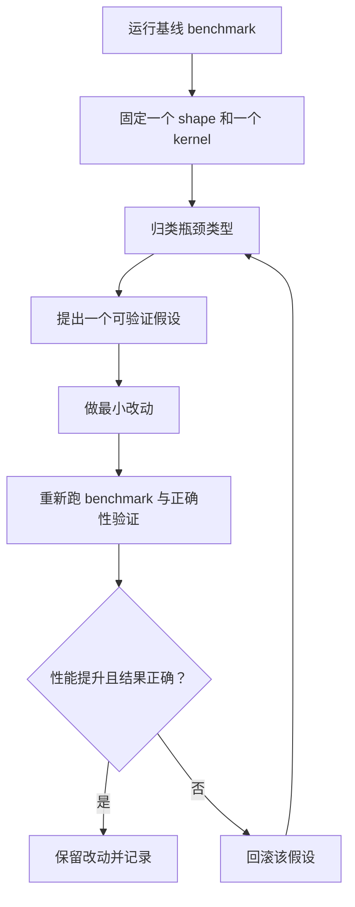

# 优化实战手册
{: .fs-8 }

面向 SGEMM 性能瓶颈的实用诊断闭环
{: .fs-6 .fw-300 }

---

## 为什么需要这页

仓库给了 5 个 kernel 和可复现的 benchmark 命令，但优化工作仍然需要方法论。
本页把方法固化成可重复使用的闭环，帮助你避免随机调参。

---

## 端到端优化闭环



一次循环只验证一个假设。一次改五件事，通常学不到任何结论。

---

## 瓶颈信号地图

| 从 benchmark 或 profiler 看到的信号 | 可能瓶颈 | 第一组实验 |
|-------------------------------------|----------|-----------|
| Naive 与 tiled 差距很小 | 共享内存复用尚未生效 | 检查 tile 加载/写回索引与占用率 |
| Tiled 提升明显但 bank-free 提升很小 | bank 冲突不是主瓶颈 | 先测全局内存吞吐是否受限 |
| Double buffer 没有收益 | 延迟重叠未真正发生 | 检查分阶段调度与寄存器压力 |
| Tensor Core 端到端低于 FP32 kernel | 转换/回退开销占主导 | 拆分端到端与仅计算结果对比 |
| WMMA 仅计算提升明显但端到端一般 | 数据搬运流水线是限制项 | 检查 host/device 转换与 launch 流程 |

---

## 实验模板

### 模板 A：固定单一 shape

```bash
./build/bin/sgemm_benchmark --dims 1024 1024 1024
```

适用于去掉 shape 噪声，只聚焦一个瓶颈。

### 模板 B：覆盖多种 shape

```bash
./build/bin/sgemm_benchmark -a
```

适用于发现只在特殊维度触发的回归。

### 模板 C：延长测量窗口

```bash
./build/bin/sgemm_benchmark -a --warmup 10 --benchmark 50
```

适用于在文档或 PR 中给出最终性能结论之前复核。

---

## Profiler 指标提示

| 关注问题 | Nsight Compute 指标提示 |
|----------|-------------------------|
| 是否带宽受限？ | `dram__throughput.avg.pct_of_peak_sustained_elapsed` |
| SM 利用率是否偏低？ | `sm__throughput.avg.pct_of_peak_sustained_elapsed` |
| 共享内存 bank 冲突是否偏高？ | `l1tex__data_bank_conflicts_pipe_lsu_mem_shared_op_ld.sum` |
| 占用率是否异常偏低？ | `sm__warps_active.avg.pct_of_peak_sustained_active` |

不要只盯单个指标优化。必须和总耗时、正确性结果一起判断。

---

## 声称提速前的质量门

- 重新运行 `ctest --test-dir build`，确认与 cuBLAS 对照通过。
- 同时比较标准 shape（`1024 x 1024 x 1024`）与至少一个不规则 shape。
- 明确标注结果是端到端还是仅计算。
- 除非有强理由，不要破坏统一 kernel launcher 契约。

---

## 相关页面

- [学习路径](learning-path/)
- [Benchmark 结果](benchmark-results/)
- [CUDA 内存速查表](cuda-memory-cheatsheet/)
