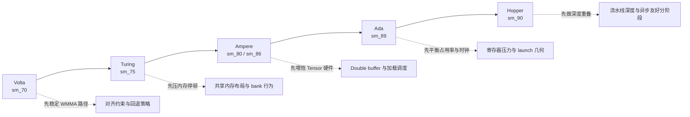

# 性能案例库
{: .fs-8 }

从 Volta 到 Hopper 的架构感知 SGEMM 调优笔记
{: .fs-6 .fw-300 }

---

## 为什么需要这份案例库

同一份 SGEMM kernel 在不同 GPU 代际上的表现差异很大。  
本页给出一份紧凑的 “先做什么” 地图，帮助你有目标地调优，而不是盲目试错。

---

## 一张图看架构与调优重点



---

## 架构策略对照表

| 架构 | 在本仓库常见表现 | 第一优先级调优点 | 高风险反模式 |
|------|------------------|------------------|--------------|
| Volta (`sm_70`) | WMMA 可用，但对齐约束常决定最终收益 | 先验证 16 对齐维度、明确 fallback、区分端到端与仅计算 | 在 shape 不受控时直接宣称 Tensor Core 提升 |
| Turing (`sm_75`) | FP32 路径常先受内存限制，计算单元未打满 | 提升合并访问、检查 bank 冲突、保持 tile 索引简洁可验证 | 在内存布局未修好前过早追指令级微调 |
| Ampere (`sm_80` / `sm_86`) | Tensor 路径上限高，但是否吃满取决于分阶段质量 | 调整 double buffer 阶段、控制寄存器占用、比较多种 block 配置 | 线程私有状态过多导致占用率坍塌 |
| Ada (`sm_89`) | 高频下更吃流水线平衡 | 复查 launch 几何、warmup/benchmark 时长、shape 多样性 | 把单一 shape 的结果当成通用结论 |
| Hopper (`sm_90`) | 重叠能力往往比单点算术优化更关键 | 优先做数据搬运重叠、显式暴露转换开销、拉长基准窗口 | 只优化 compute-only，端到端仍被搬运瓶颈锁死 |

---

## 典型案例模式

### 案例 A：Volta/Turing 上 Tensor Core 提升不明显

**信号**  
`WMMA 端到端` 与 FP32 kernel 接近，甚至更低。

**常见原因**
- 大量维度不是 16 对齐，频繁触发 fallback。
- 转换与 wrapper 开销抵消了计算收益。

**建议动作**
1. 同时测一个 16 对齐 shape 和一个不规则 shape。
2. 明确对比 `WMMA 仅计算` 与 `WMMA 端到端`。
3. 调优转换/分阶段边界时，保持 fallback 行为不变。

### 案例 B：Ampere/Ada 在 tiled 之后增益停滞

**信号**  
`Tiled` 提升明显，但 `Double Buffer` 与 `Tensor Core` 增益有限。

**常见原因**
- 阶段重叠不完整。
- 寄存器压力过高，活跃 warp 降低。

**建议动作**
1. 先尝试更小的 block/tile 组合，恢复占用率。
2. 检查增加阶段后总耗时是否反而上升。
3. 每次 launch 参数调整后都重新对照 cuBLAS 正确性。

### 案例 C：Hopper 上 compute-only 很强，端到端不动

**信号**  
`WMMA 仅计算` 提升明显，但完整流程速度几乎不变。

**常见原因**
- 数据搬运或转换流程占主导。
- benchmark 设置对流水线预热不够友好。

**建议动作**
1. 提高 warmup 与 benchmark 轮次，先稳定测量窗口。
2. 单独分析转换与 launch 开销段。
3. 先优化重叠策略，再动微观算术内核细节。

---

## 最小跨架构基准矩阵

在做跨架构结论前，至少跑以下矩阵：

```text
Shape 集：
- 1024 x 1024 x 1024  （标准对齐）
- 1536 x 768  x 2048  （长宽比混合）
- 1000 x 1000 x 1000  （非 16 对齐压力）

命令集：
- ./build/bin/sgemm_benchmark -a
- ./build/bin/sgemm_benchmark --dims M K N
- ./build/bin/sgemm_benchmark -a --warmup 10 --benchmark 50
```

---

## 保持结论可信的汇报规则

- 必须给出 GPU 型号、CUDA 版本，并标注结果是端到端还是仅计算。
- 不要把 “仅对齐 shape” 的结果与 “混合 shape 基线” 直接混比且不标注范围。
- 调优性能时不要修改 cuBLAS 对照与容差策略。

---

## 相关页面

- [Benchmark 结果](benchmark-results/)
- [优化实战手册](optimization-playbook/)
- [CUDA 内存速查表](cuda-memory-cheatsheet/)
