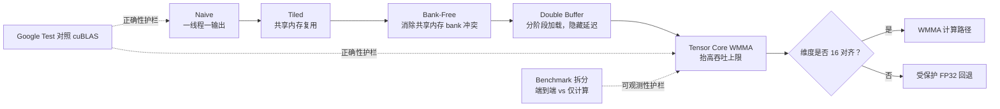

<div class="home-shell">
  <div class="home-hero-grid">
    <div>
      <p class="home-eyebrow">CUDA SGEMM ENGINEERING NOTEBOOK</p>
      <h1 class="home-main-title">SGEMM Optimization</h1>
      <p class="home-main-subtitle">
        一个双语、可基准验证的 CUDA SGEMM 学习站点：从基线 FP32 kernel 到带保护回退的 Tensor Core WMMA。
        让代码可读，让每一次提速都可解释。
      </p>
      <div class="home-action-row">
        <a class="btn" href="docs/getting-started/">5 分钟开始</a>
        <a class="btn btn-outline" href="docs/learning-path/">跟随优化阶梯</a>
        <a class="btn btn-outline" href="https://github.com/LessUp/sgemm-optimization">GitHub</a>
      </div>
    </div>
    <div class="signal-grid">
      <div class="signal-card">
        <div class="signal-title">优化阶段</div>
        <div class="signal-value">5</div>
        <div class="signal-note">naive -> WMMA</div>
      </div>
      <div class="signal-card">
        <div class="signal-title">正确性对照</div>
        <div class="signal-value">cuBLAS</div>
        <div class="signal-note">FP32 / Tensor Core 分别使用容差</div>
      </div>
      <div class="signal-card">
        <div class="signal-title">验证边界</div>
        <div class="signal-value">CI + GPU</div>
        <div class="signal-note">CI 负责编译，本地 GPU 负责运行时验证</div>
      </div>
      <div class="signal-card">
        <div class="signal-title">语言支持</div>
        <div class="signal-value">EN / 中文</div>
        <div class="signal-note">中英文页面一一对应，自动跳转</div>
      </div>
    </div>
  </div>
</div>

## 一张图看完整个项目



## 核心精华

| 精华 | 价值 | 对应入口 |
|------|------|----------|
| 渐进式 kernel 阶梯 | 每一步优化只回答一个问题，并且可量化 | [学习路径](docs/learning-path/) |
| 统一 launcher 契约 | kernel 可替换，可对比，可验证 | [架构概览](docs/architecture/) |
| 验证先行工作流 | 任何性能结论都绑定正确性检查 | [Benchmark 结果](docs/benchmark-results/) |
| OpenSpec 治理 | 文档、实现、仓库流程保持一致 | [规范索引](specs/) |

## 知识补给站

<div class="knowledge-grid">
  <a class="knowledge-card" href="docs/optimization-playbook/">
    <h3>优化实战手册</h3>
    <p>提供 SGEMM 性能瓶颈诊断闭环、决策树和实验模板，方便快速定位问题。</p>
  </a>
  <a class="knowledge-card" href="docs/performance-casebook/">
    <h3>性能案例库</h3>
    <p>按 Volta、Turing、Ampere、Ada、Hopper 架构整理调优重点和建议动作。</p>
  </a>
  <a class="knowledge-card" href="docs/cuda-memory-cheatsheet/">
    <h3>CUDA 内存速查表</h3>
    <p>把内存合并访问、共享内存 bank、占用率提示和 profiler 指标放在同一张地图里。</p>
  </a>
  <a class="knowledge-card" href="docs/kernel-tensor-core/">
    <h3>Tensor Core 实战</h3>
    <p>理解 WMMA 的对齐约束，以及为什么带保护回退能保证稳定行为。</p>
  </a>
</div>

## 命令驾驶舱

```bash
# 编译
cmake -S . -B build -DCMAKE_BUILD_TYPE=Release
cmake --build build -j$(nproc)

# 验证
ctest --test-dir build
openspec validate --all

# 基准测试
./build/bin/sgemm_benchmark -a
./build/bin/sgemm_benchmark --dims 256 384 640
```

## 按目标开始

| 如果你想... | 从这里开始 |
|-------------|-----------|
| 编译并跑通一次 | [快速上手](docs/getting-started/) |
| 按设计顺序学习 | [学习路径](docs/learning-path/) |
| 建立优化诊断能力 | [优化实战手册](docs/optimization-playbook/) |
| 按 GPU 架构做针对性调优 | [性能案例库](docs/performance-casebook/) |
| 快速复习 CUDA 内存知识 | [CUDA 内存速查表](docs/cuda-memory-cheatsheet/) |
| 切换到英文站点 | [English Home](../) |
